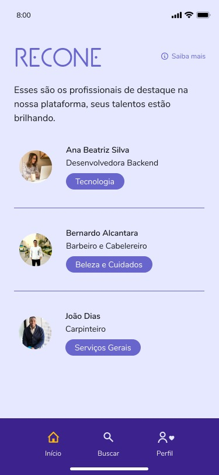
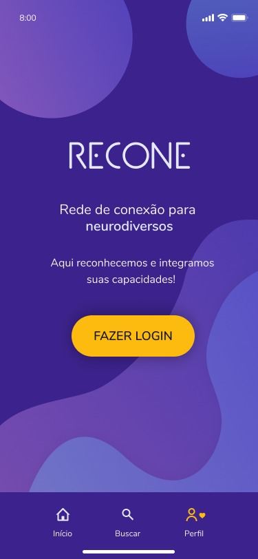
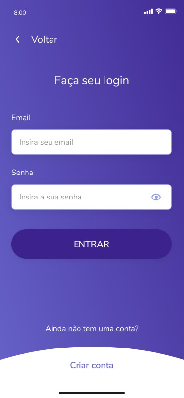
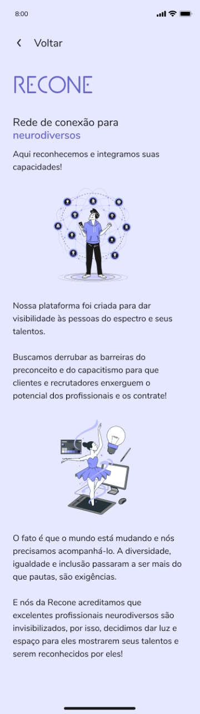
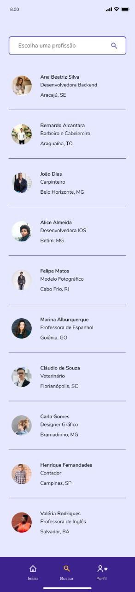
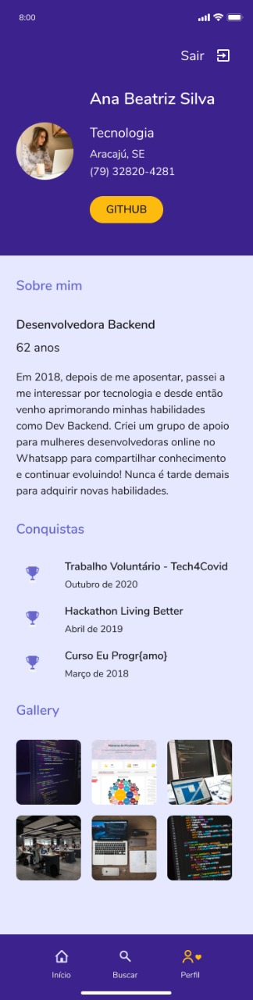

# Recone App IOS :iphone: :speaking_head: :brain:

## :pushpin: Introdução
Aplicativo para da visibilidade para pessoas neurodivergentes.

### :memo: Descrição
Nosso objetivo é combater o capacitismo, discriminação e o preconceito social contra pessoas neurodivergentes. Quebrando preconceitos e proporcionando o reconhecimento profissional dessas pessoas.

Example 

      

      

### :desktop_computer:  Deverá ter instalado em sua máquina:
- [Cocoapods](https://guides.cocoapods.org/using/getting-started.html)

### :thinking:  Como buildar o app na sua máquina:
- Entre dentro do diretório(pasta) `/Recone` pelo terminal e execute via command line:
```
$ pod install
```

- Sempre abra o projeto pelo arquivo Recone.xcworkspace

- Selecione o simulador de sua preferência e build o projeto

:star_struck: Pronto, se tudo ocorrer bem, você deverá ser capaz de rodar o projeto em sua máquina
